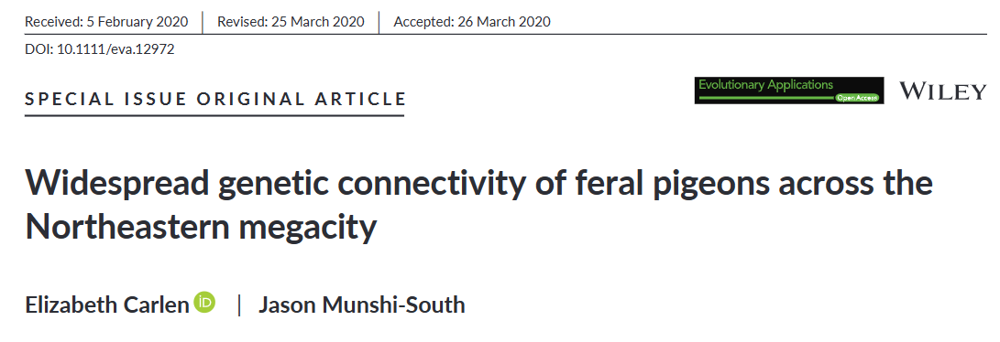

# (PART\*) Student Guide {-}

# Activity Overview

This activity is based on work published by Drs. Elizabeth Carlen and Jason Munshi-South in 2021, "Widespread genetic connectivity of feral pigeons across the Northeastern megacity".



In this module, you will work with SNP data from a subsample of 50 feral pigeons (collected in 6 different Northeastern US cities) that were captured and sampled in Carlen and Munshi-South's study. You will calculate PCA and create plots to visualize the population structure among these pigeons using the R programming language.

You can read the full study [here](https://onlinelibrary.wiley.com/doi/epdf/10.1111/eva.12972).


This is a brief video introduction to the activity.

You can view and download the Google Slides [here](https://docs.google.com/presentation/d/1meLiZzX1TSPvSOMwOSXUX9FyM82fZk1iqGpF3j6PsNM/edit?usp=sharing)

# Before you begin

Before diving into the activity, you'll need to do a couple of things first, including creating a Google account to use AnVIL and cloning the activity workspace.

## Accessing AnVIL

You will need to create a Google account in order to use AnVIL.

```{r, echo = FALSE, results='asis'}
cow::borrow_chapter(
  doc_path = "child/_child_google_create_account.Rmd",
  repo_name = "jhudsl/AnVIL_Template"
)
```

## Cloning the workspace

You will also need to clone the AnVIL workspace for this activity.

## Using RStudio

This activity uses the RStudio environment on AnVIL.

### Video overview on using RStudio

```{r, echo = FALSE, results='asis'}
cow::borrow_chapter(
  doc_path = "child/_child_rstudio_video.Rmd",
  repo_name = "jhudsl/AnVIL_Template"
)
```

### Launching RStudio

```{r, echo = FALSE, results='asis'}
cow::borrow_chapter(
  doc_path = "child/_child_rstudio_launch.Rmd",
  repo_name = "jhudsl/AnVIL_Template"
)
```

### Touring RStudio

```{r, echo = FALSE, results='asis'}
cow::borrow_chapter(
  doc_path = "child/_child_rstudio_tour.Rmd",
  repo_name = "jhudsl/AnVIL_Template"
)
```

### Pausing RStudio

```{r, echo = FALSE, results='asis'}
cow::borrow_chapter(
  doc_path = "child/_child_rstudio_pause.Rmd",
  repo_name = "jhudsl/AnVIL_Template"
)
```


### Deleting RStudio


```{r, echo = FALSE, results='asis'}
cow::borrow_chapter(
  doc_path = "child/_child_rstudio_delete.Rmd",
  repo_name = "jhudsl/AnVIL_Template"
)
```