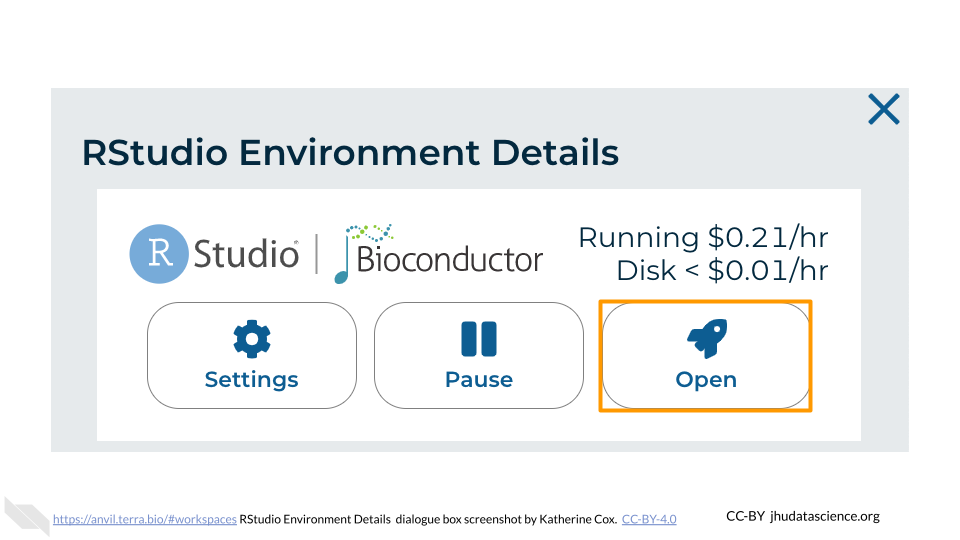
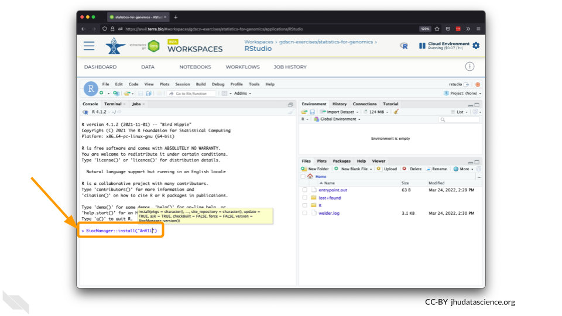
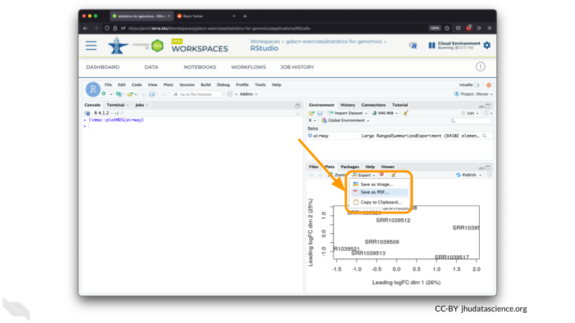
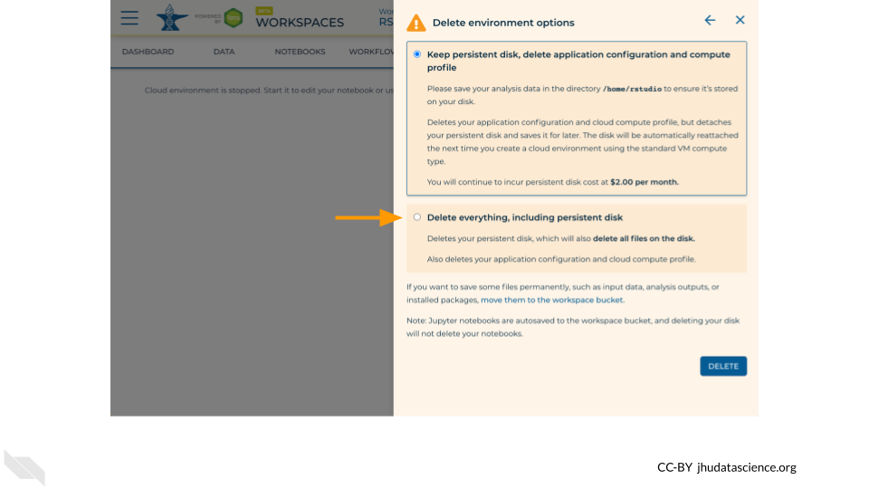

# (PART\*) Student Guide {-}

# Activity Overview

This activity is based on work published by Drs. Elizabeth Carlen and Jason Munshi-South in 2021, "Widespread genetic connectivity of feral pigeons across the Northeastern megacity". In this module, you will work with SNP data from a subsample of 50 feral pigeons (collected in 5 different Northeastern US cities) that were captured and sampled in Carlen and Munshi-South's study. You will calculate PCA and create plots to visualize the population structure among these pigeons using the R programming language.

You can read the full study [here](https://onlinelibrary.wiley.com/doi/epdf/10.1111/eva.12972).

# Introduction

This is a brief video introduction to the activity.

You can view and download the Google Slides [here](https://docs.google.com/presentation/d/1meLiZzX1TSPvSOMwOSXUX9FyM82fZk1iqGpF3j6PsNM/edit#slide=id.p)

# Before you begin

You will need to create a Google account in order to use AnVIL.

If you do not already have a Google account that you would like to use for accessing Terra, [create one now](https://accounts.google.com/SignUp).

If you would like to create a Google account that is associated with your non-Gmail, institutional email address, follow [these instructions](https://support.terra.bio/hc/en-us/articles/360029186611).

# RStudio

This activity uses the RStudio environment on AnVIL.

## Video overview on using RStudio

Here is a video tutorial that describes the basics of using RStudio on AnVIL.

<iframe src="https://drive.google.com/file/d/1v72ZG8JIRDUaewFQgGfcCO_qoM4eYmYX/preview" width="640" height="360" allow="autoplay"></iframe>

### Objectives

- Start compute for your RStudio environment
- Tour RStudio on AnVIL
- Stop compute to minimize expenses

### Slides

The slides for this tutorial are are located [here](https://docs.google.com/presentation/d/1eypYLLqD11-NwHLs4adGpcuSB07dYEJfAaALSMvgzqw).

## Launching RStudio

:::{.warning}
AnVIL is very versatile and can scale up to use very powerful cloud computers. It's very important that you select a cloud computing environment appropriate to your needs to avoid runaway costs.  If you are uncertain, start with the default settings; it is fairly easy to increase your compute resources later, if needed, but harder to scale down.
:::

Note that, in order to use RStudio, you must have access to a Terra Workspace with permission to compute (i.e. you must be a "Writer" or "Owner" of the Workspace).

1. Open Terra - use a web browser to go to [`anvil.terra.bio`](https://anvil.terra.bio/)

1. In the drop-down menu on the left, navigate to "Workspaces". Click the triple bar in the top left corner to access the menu. Click "Workspaces".

    

1. Click on the name of your Workspace. You should be routed to a link that looks like: `https://anvil.terra.bio/#workspaces/<billing-project>/<workspace-name>`.

1. Click on the cloud icon on the far right to access your Cloud Environment options.

    

1. In the dialogue box, click the "Settings" button under RStudio

    

1. You will see some details about the default RStudio cloud environment, and a list of costs because it costs a small amount of money to use cloud computing.

    

1. If you are uncertain about what you need, the default configuration is a reasonable, cost-conservative choice.  It is fairly easy to increase your compute resources later, if needed, but harder to scale down. Click the “Create” button.

    

1. Otherwise, click “CUSTOMIZE” to modify the environment for your needs.

    

    

    

    

    

    

1. The dialogue box will close and you will be returned to your Workspace.  You can see the status of your cloud environment by hovering over the RStudio logo.  It will take a few minutes for Terra to request computers and install software.

    

1. When your environment is ready, its status will change to “Running”.  Click on the RStudio logo to open a new dialogue box that will let you launch RStudio.

    
    
1. Click the launch icon to open RStudio.  This is also where you can pause, modify, or delete your environment when needed.

    

1. You should now see the RStudio interface with information about the version printed to the console.

    

## Touring RStudio

Next, we will be using RStudio and the package `Glimma` to create interactive plots. See [this vignette](https://bioconductor.org/packages/release/bioc/vignettes/Glimma/inst/doc/limma_edger.html) for more information.

1. The Bioconductor team has created a very useful package to programmatically interact with Terra and Google Cloud. Install the `AnVIL` package. It will make some steps easier as we go along.

    

    

1. You can now quickly install precompiled binaries using the AnVIL package’s `install()` function. We will use it to install the `Glimma` package and the `airway` package. The `airway` package contains a `SummarizedExperiment` data class. This data describes an RNA-Seq experiment on four human airway smooth muscle cell lines treated with dexamethasone. 

{Note: for some of the packages, you will have to install packaged from the CRAN repository, using the install.packages() function. The examples will show you which install method to use.}

    

    

1. Load the example data.

    

    

1. The multidimensional scaling (MDS) plot is frequently used to explore differences in samples. When this data is MDS transformed, the first two dimensions explain the greatest variance between samples, and the amount of variance decreases monotonically with increasing dimension. The following code will launch a new window where you can interact with the MDS plot.

    

    

1. Change the `colour_by` setting to "groups" so you can easily distinguish between groups. In this data, the "group" is the treatment.

    

1. You can download the interactive html file by clicking on "Save As".

    

1. You can also download plots and other files created directly in RStudio. To download the following plot, click on "Export" and save in your preferred format to the default directory. This saves the file in your cloud environment.

    

    

1. You should see the plot in the "Files" pane.

    

1. Select this file and click "More" > "Export"

    

1. Select "Download" to save the file to your local machine.

    

## Pausing RStudio

1. The upper right corner reminds you that you are accruing cloud computing costs.

    

1. You should minimize charges when you are not performing an analysis. You can do this by clicking on “Stop cloud environment”. This will release the CPU and memory resources for other people to use. Note that your work will be saved in the environment and continue to accrue a very small cost.  This work will be lost if the cloud environment gets deleted.  If there is anything you would like to save permanently, it's a good idea to copy it from your compute environment to another location, such as the Workspace bucket, GitHub, or your local machine, depending on your needs.

    

## Deleting RStudio

1. Stopping your cloud environment only pauses your work. When you are ready to delete the cloud environment, click on the gear icon in the upper right corner to “Update cloud environment”.

    

1. Click on “Delete Environment Options”.

    

1. If you are certain that you do not need the data and configuration on your disk, you should select "Delete everything, including persistent disk".  If there is anything you would like to save, open the compute environment and copy the file(s) from your compute environment to another location, such as the Workspace bucket, GitHub, or your local machine, depending on your needs.

    

1. Select "DELETE".

    
